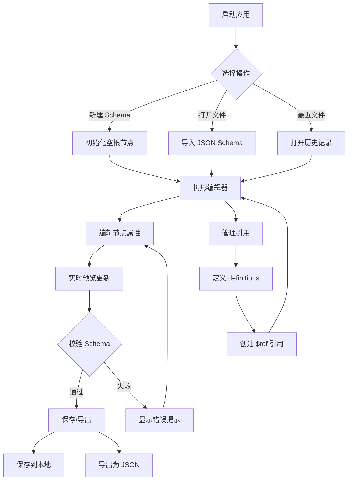

# 产品需求文档（PRD）

## 1. 产品概述

一款基于 Electron 的可视化 JSON Schema 编辑器，提供直观的树形界面用于创建、编辑和管理 JSON Schema 文件。

- **主要用途**：让开发者和设计师无需手写 JSON 即可可视化构建符合 Draft-07 规范的 JSON Schema
- **解决的问题**：降低 JSON Schema 编写门槛，减少语法错误，提升 Schema 设计效率
- **目标用户**：前端开发者、后端开发者、API 设计师、技术文档编写者
- **市场价值**：填补可视化 JSON Schema 编辑工具的空白，提升开发体验和效率

## 2. 核心功能

### 2.1 用户角色

本产品为单机桌面应用，无需用户角色区分。

### 2.2 功能模块

1. **主编辑页面**：树形结构编辑器、属性面板、实时预览
2. **引用管理页面**：$ref 引用定义和管理
3. **导入导出页面**：文件导入导出功能

### 2.3 页面详情

| 页面名称 | 模块名称 | 功能描述 |
|---------|---------|---------|
| 主编辑页面 | 树形结构编辑器 | 可视化展示 JSON Schema 层级结构，支持展开/折叠节点，拖拽排序属性，添加/删除节点 |
| 主编辑页面 | 属性编辑面板 | 编辑选中节点的属性（type、title、description、required、enum、default 等） |
| 主编辑页面 | 实时预览面板 | 实时展示生成的 JSON Schema 代码，支持语法高亮和格式化 |
| 主编辑页面 | 工具栏 | 新建、打开、保存、导入、导出、撤销、重做、校验等功能按钮 |
| 主编辑页面 | 校验提示区 | 显示 Schema 校验错误和警告信息 |
| 引用管理页面 | 引用列表 | 展示所有已定义的 $ref 引用 |
| 引用管理页面 | 引用编辑器 | 创建和编辑引用定义 |
| 导入导出页面 | 文件导入 | 支持从本地文件导入 JSON Schema |
| 导入导出页面 | 文件导出 | 支持导出为 JSON Schema 文件 |

## 3. 核心流程

### 3.1 创建新 Schema 流程

用户启动应用后，可以选择创建新的 JSON Schema 或打开现有文件。创建新 Schema 时，系统初始化一个空的根节点，用户在树形编辑器中通过右键菜单或工具栏按钮添加属性节点。每个节点可以设置类型（string、number、boolean、object、array、null）、标题、描述、是否必填等属性。编辑过程中，右侧预览面板实时更新生成的 JSON Schema 代码。用户完成编辑后，可以保存为本地文件或导出为 JSON 文件。

### 3.2 编辑现有 Schema 流程

用户通过"打开文件"功能导入现有的 JSON Schema 文件。系统解析文件内容并将其转换为树形结构展示在编辑器中。用户可以可视化编辑各个节点的属性，添加或删除节点，调整节点顺序。编辑过程中，系统实时校验 Schema 的合法性，并在提示区显示错误或警告。用户完成编辑后保存更改。

### 3.3 引用管理流程

用户在编辑过程中可以定义可复用的 Schema 片段（definitions），并在其他节点中通过 $ref 引用这些片段。引用管理模块提供统一的界面查看所有引用定义，支持创建、编辑、删除引用。当引用被修改时，所有引用该片段的地方会自动更新。

### 3.4 流程图

## 4. 用户界面设计

### 4.1 设计风格

- **主色调**：深蓝色（#1e3a8a）作为主色，搭配浅灰色（#f3f4f6）背景
- **辅助色**：绿色（#10b981）表示成功状态，红色（#ef4444）表示错误，橙色（#f59e0b）表示警告
- **按钮样式**：圆角矩形（border-radius: 6px），轻微阴影，hover 时加深颜色
- **字体**：
  - 标题字体：Inter 或 system-ui，字号 16-20px
  - 正文字体：Inter 或 system-ui，字号 14px
  - 代码字体：JetBrains Mono 或 Fira Code，字号 13px
- **布局风格**：三栏布局（左侧树形编辑器 + 中间属性面板 + 右侧预览），顶部工具栏，底部状态栏
- **图标风格**：使用 Lucide React 图标库，线性风格，1.5px 描边

### 4.2 页面设计概览

| 页面名称 | 模块名称 | UI 元素 |
|---------|---------|---------|
| 主编辑页面 | 树形结构编辑器 | 可折叠树形组件，节点带图标标识类型，右键菜单，拖拽手柄，选中高亮 |
| 主编辑页面 | 属性编辑面板 | 表单组件（输入框、下拉选择、复选框、文本域），分组展示属性 |
| 主编辑页面 | 实时预览面板 | 代码编辑器样式，语法高亮，行号显示，可折叠/展开 |
| 主编辑页面 | 工具栏 | 图标按钮组，分隔符，下拉菜单，搜索框 |
| 主编辑页面 | 校验提示区 | 错误列表，警告列表，点击可定位到问题节点 |
| 引用管理页面 | 引用列表 | 卡片式列表，每个引用显示名称、路径、使用次数 |
| 引用管理页面 | 引用编辑器 | 模态框或侧边抽屉，包含引用定义表单 |
| 导入导出页面 | 文件导入 | 文件选择对话框，拖拽上传区域，格式说明 |
| 导入导出页面 | 文件导出 | 导出选项（格式化、压缩），文件路径选择，导出按钮 |

### 4.3 响应式设计

- **桌面优先**：针对 1280px 及以上屏幕优化
- **自适应布局**：
  - 大屏（≥1600px）：三栏并排，左侧 30%，中间 30%，右侧 40%
  - 中屏（1280px-1599px）：三栏并排，左侧 35%，中间 30%，右侧 35%
  - 小屏（<1280px）：可折叠面板，通过标签页切换不同视图
- **触控优化**：按钮最小点击区域 44x44px，拖拽操作支持触控

### 4.4 交互细节

- **树形节点交互**：
  - 单击选中节点
  - 双击展开/折叠节点
  - 右键打开上下文菜单（添加子节点、删除节点、复制、粘贴等）
  - 拖拽节点调整顺序或层级
- **属性编辑交互**：
  - 输入框失焦时自动保存
  - 下拉选择即时生效
  - 复选框切换立即更新 Schema
- **预览面板交互**：
  - 支持代码折叠
  - 支持复制到剪贴板
  - 支持格式化/压缩切换
- **快捷键支持**：
  - Ctrl+S：保存
  - Ctrl+Z：撤销
  - Ctrl+Y：重做
  - Delete：删除选中节点
  - Ctrl+C/V：复制粘贴节点
