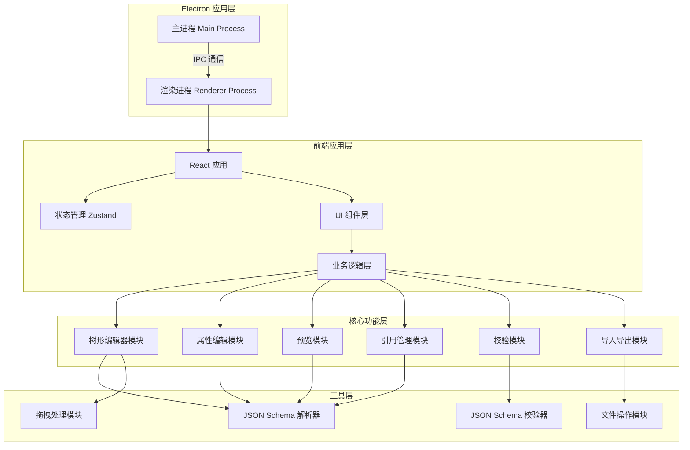

# 技术架构文档

## 1. 架构设计



## 2. 技术描述

### 2.1 核心技术栈

- **桌面框架**：Electron 28.x
- **前端框架**：React 18.x
- **开发语言**：TypeScript 5.x
- **构建工具**：Vite 5.x + electron-vite
- **样式方案**：Tailwind CSS 3.x
- **状态管理**：Zustand 4.x
- **代码编辑器**：Monaco Editor（用于 JSON 预览）
- **树形组件**：react-arborist（支持拖拽的树形组件）
- **拖拽库**：@dnd-kit/core + @dnd-kit/sortable
- **JSON Schema 校验**：ajv 8.x
- **图标库**：lucide-react

### 2.2 项目结构

```
json-schema-viewer/
├── electron/                  # Electron 主进程代码
│   ├── main.ts               # 主进程入口
│   ├── preload.ts            # 预加载脚本
│   └── ipc/                  # IPC 通信处理
│       ├── file-handlers.ts  # 文件操作处理
│       └── window-handlers.ts # 窗口操作处理
├── src/                      # React 渲染进程代码
│   ├── main.tsx             # React 入口
│   ├── App.tsx              # 根组件
│   ├── components/          # UI 组件
│   │   ├── Toolbar/         # 工具栏
│   │   ├── TreeEditor/      # 树形编辑器
│   │   ├── PropertyPanel/   # 属性编辑面板
│   │   ├── PreviewPanel/    # 预览面板
│   │   ├── RefManager/      # 引用管理
│   │   └── common/          # 通用组件
│   ├── stores/              # Zustand 状态管理
│   │   ├── schemaStore.ts   # Schema 数据状态
│   │   ├── editorStore.ts   # 编辑器状态
│   │   └── uiStore.ts       # UI 状态
│   ├── services/            # 业务逻辑服务
│   │   ├── schemaService.ts # Schema 操作服务
│   │   ├── validationService.ts # 校验服务
│   │   ├── importExportService.ts # 导入导出服务
│   │   └── refService.ts    # 引用管理服务
│   ├── utils/               # 工具函数
│   │   ├── schemaParser.ts  # Schema 解析
│   │   ├── schemaGenerator.ts # Schema 生成
│   │   └── treeUtils.ts     # 树形操作工具
│   ├── types/               # TypeScript 类型定义
│   │   ├── schema.ts        # Schema 类型
│   │   └── editor.ts        # 编辑器类型
│   └── styles/              # 全局样式
│       └── globals.css
├── package.json
├── tsconfig.json
├── vite.config.ts
├── electron.vite.config.ts
└── tailwind.config.js
```

## 3. 数据模型

### 3.1 核心数据结构

```typescript
// JSON Schema 节点类型
interface SchemaNode {
  id: string;                    // 唯一标识
  type: SchemaType;              // 节点类型
  title?: string;                // 标题
  description?: string;          // 描述
  properties?: Record<string, SchemaNode>; // 对象属性
  items?: SchemaNode | SchemaNode[];       // 数组项
  required?: string[];           // 必填字段
  enum?: any[];                  // 枚举值
  default?: any;                 // 默认值
  $ref?: string;                 // 引用路径
  definitions?: Record<string, SchemaNode>; // 定义
  // 其他 JSON Schema 属性
  minimum?: number;
  maximum?: number;
  minLength?: number;
  maxLength?: number;
  pattern?: string;
  format?: string;
  // 元数据
  _parentId?: string;            // 父节点 ID
  _order: number;                // 排序顺序
}

type SchemaType = 'string' | 'number' | 'integer' | 'boolean' | 'object' | 'array' | 'null';

// 编辑器状态
interface EditorState {
  selectedNodeId: string | null;
  expandedNodes: Set<string>;
  clipboard: SchemaNode | null;
  isDirty: boolean;              // 是否有未保存的更改
  filePath: string | null;       // 当前文件路径
}

// 校验结果
interface ValidationResult {
  valid: boolean;
  errors: ValidationError[];
  warnings: ValidationWarning[];
}

interface ValidationError {
  path: string;                  // 错误路径
  message: string;               // 错误信息
  keyword: string;               // 错误关键字
}

interface ValidationWarning {
  path: string;
  message: string;
  severity: 'warning' | 'info';
}
```

### 3.2 状态管理设计

```typescript
// Schema 状态管理
interface SchemaStore {
  // 状态
  rootSchema: SchemaNode | null;
  definitions: Record<string, SchemaNode>;
  
  // 操作
  setRootSchema: (schema: SchemaNode) => void;
  updateNode: (nodeId: string, updates: Partial<SchemaNode>) => void;
  addNode: (parentId: string | null, node: SchemaNode) => void;
  removeNode: (nodeId: string) => void;
  moveNode: (nodeId: string, newParentId: string, newIndex: number) => void;
  
  // 引用管理
  addDefinition: (name: string, schema: SchemaNode) => void;
  updateDefinition: (name: string, schema: SchemaNode) => void;
  removeDefinition: (name: string) => void;
  createRef: (definitionName: string) => string;
}

// 编辑器状态管理
interface EditorStore {
  // 状态
  selectedNodeId: string | null;
  expandedNodes: Set<string>;
  clipboard: SchemaNode | null;
  isDirty: boolean;
  filePath: string | null;
  
  // 操作
  selectNode: (nodeId: string | null) => void;
  toggleExpand: (nodeId: string) => void;
  expandAll: () => void;
  collapseAll: () => void;
  copyNode: (node: SchemaNode) => void;
  pasteNode: (parentId: string) => void;
  markDirty: () => void;
  markClean: () => void;
}
```

## 4. 核心模块设计

### 4.1 树形编辑器模块

**功能职责**：
- 可视化展示 JSON Schema 层级结构
- 支持节点展开/折叠
- 支持节点选择、编辑
- 支持拖拽排序和移动节点
- 支持右键上下文菜单

**技术实现**：
- 使用 react-arborist 作为基础树形组件
- 自定义节点渲染器，根据类型显示不同图标
- 集成 @dnd-kit 实现拖拽功能
- 实现虚拟滚动优化大 Schema 性能

**关键接口**：
```typescript
interface TreeEditorProps {
  schema: SchemaNode;
  selectedNodeId: string | null;
  expandedNodes: Set<string>;
  onSelectNode: (nodeId: string) => void;
  onToggleExpand: (nodeId: string) => void;
  onMoveNode: (nodeId: string, newParentId: string, newIndex: number) => void;
  onContextMenu: (nodeId: string, event: React.MouseEvent) => void;
}
```

### 4.2 属性编辑面板模块

**功能职责**：
- 编辑选中节点的所有属性
- 根据节点类型动态显示可编辑属性
- 提供类型提示和输入验证
- 实时更新 Schema 数据

**技术实现**：
- 使用表单组件库（React Hook Form + Zod）
- 根据节点类型条件渲染表单字段
- 输入防抖处理，避免频繁更新
- 支持批量编辑（如 required 字段）

**关键接口**：
```typescript
interface PropertyPanelProps {
  node: SchemaNode | null;
  onUpdateNode: (nodeId: string, updates: Partial<SchemaNode>) => void;
}
```

### 4.3 预览面板模块

**功能职责**：
- 实时展示生成的 JSON Schema
- 提供语法高亮
- 支持代码折叠
- 支持复制到剪贴板
- 支持格式化/压缩切换

**技术实现**：
- 使用 Monaco Editor 作为代码编辑器
- 监听 Schema 状态变化，实时更新预览
- 提供 JSON 格式化和压缩功能
- 支持错误定位（点击错误跳转到对应节点）

**关键接口**：
```typescript
interface PreviewPanelProps {
  schema: SchemaNode | null;
  onCopyToClipboard: () => void;
}
```

### 4.4 引用管理模块

**功能职责**：
- 管理 Schema 的 definitions
- 创建和编辑 $ref 引用
- 显示引用关系图
- 自动更新引用

**技术实现**：
- 维护全局 definitions 字典
- 提供引用创建向导
- 检测循环引用
- 引用变更时自动更新所有引用处

**关键接口**：
```typescript
interface RefManagerProps {
  definitions: Record<string, SchemaNode>;
  onAddDefinition: (name: string, schema: SchemaNode) => void;
  onUpdateDefinition: (name: string, schema: SchemaNode) => void;
  onRemoveDefinition: (name: string) => void;
}
```

### 4.5 校验模块

**功能职责**：
- 实时校验 Schema 合法性
- 显示错误和警告信息
- 支持点击错误定位到问题节点
- 提供修复建议

**技术实现**：
- 使用 ajv 进行 JSON Schema 校验
- 防抖处理，避免频繁校验
- 将校验错误映射到具体节点
- 提供友好的错误提示

**关键接口**：
```typescript
interface ValidationService {
  validate: (schema: SchemaNode) => ValidationResult;
  validateNode: (node: SchemaNode) => ValidationResult;
}
```

### 4.6 导入导出模块

**功能职责**：
- 导入 JSON Schema 文件
- 导出为 JSON Schema 文件
- 支持格式化和压缩选项
- 处理文件路径和权限

**技术实现**：
- 使用 Electron 的 dialog API 打开文件选择器
- 使用 fs 模块读写文件
- 解析导入的 JSON Schema 并转换为内部数据结构
- 将内部数据结构序列化为标准 JSON Schema

**关键接口**：
```typescript
interface ImportExportService {
  importSchema: (filePath: string) => Promise<SchemaNode>;
  exportSchema: (schema: SchemaNode, filePath: string, options: ExportOptions) => Promise<void>;
}

interface ExportOptions {
  format: boolean;       // 是否格式化
  indentSize: number;    // 缩进大小
}
```

## 5. Electron 主进程设计

### 5.1 主进程职责

- 创建和管理应用窗口
- 处理文件系统操作
- 处理菜单和快捷键
- 处理应用生命周期

### 5.2 IPC 通信设计

```typescript
// 文件操作 IPC
ipcMain.handle('file:open', async () => {
  const result = await dialog.showOpenDialog({
    filters: [{ name: 'JSON Schema', extensions: ['json'] }]
  });
  if (!result.canceled) {
    const content = await fs.readFile(result.filePaths[0], 'utf-8');
    return { path: result.filePaths[0], content };
  }
  return null;
});

ipcMain.handle('file:save', async (event, { filePath, content }) => {
  await fs.writeFile(filePath, content, 'utf-8');
  return true;
});

// 窗口操作 IPC
ipcMain.handle('window:minimize', (event) => {
  BrowserWindow.fromWebContents(event.sender).minimize();
});

ipcMain.handle('window:maximize', (event) => {
  const win = BrowserWindow.fromWebContents(event.sender);
  if (win.isMaximized()) {
    win.unmaximize();
  } else {
    win.maximize();
  }
});

ipcMain.handle('window:close', (event) => {
  BrowserWindow.fromWebContents(event.sender).close();
});
```

### 5.3 预加载脚本

```typescript
// preload.ts
import { contextBridge, ipcRenderer } from 'electron';

contextBridge.exposeInMainWorld('electronAPI', {
  file: {
    open: () => ipcRenderer.invoke('file:open'),
    save: (filePath: string, content: string) => 
      ipcRenderer.invoke('file:save', { filePath, content }),
    saveAs: () => ipcRenderer.invoke('file:saveAs'),
  },
  window: {
    minimize: () => ipcRenderer.invoke('window:minimize'),
    maximize: () => ipcRenderer.invoke('window:maximize'),
    close: () => ipcRenderer.invoke('window:close'),
  },
});
```

## 6. 性能优化策略

### 6.1 渲染性能

- **虚拟滚动**：大 Schema 使用虚拟滚动，只渲染可见节点
- **防抖更新**：属性编辑使用防抖，避免频繁更新状态
- ** memoization**：使用 React.memo 和 useMemo 优化组件渲染
- **懒加载**：预览面板使用懒加载，首次展开时初始化 Monaco Editor

### 6.2 状态管理优化

- **状态切片**：将状态分为多个独立的 store，减少不必要的重渲染
- **选择器优化**：使用浅比较选择器，避免不必要的组件更新
- **批量更新**：使用 Zustand 的 batch 功能批量更新状态

### 6.3 文件操作优化

- **异步操作**：所有文件操作使用异步 API，避免阻塞 UI
- **大文件处理**：大文件分块读取和写入
- **缓存机制**：缓存最近打开的文件列表

## 7. 安全考虑

### 7.1 内容安全策略

- 启用 CSP（Content Security Policy）
- 禁用 nodeIntegration
- 启用 contextIsolation
- 使用预加载脚本暴露安全的 API

### 7.2 文件操作安全

- 验证文件路径，防止路径遍历攻击
- 限制可访问的目录
- 文件操作前检查权限

### 7.3 数据安全

- 不执行导入的 JSON 中的代码
- 验证导入的 Schema 格式
- 限制文件大小

## 8. 测试策略

### 8.1 单元测试

- 使用 Vitest 进行单元测试
- 覆盖核心业务逻辑（schemaService、validationService 等）
- 覆盖工具函数（schemaParser、treeUtils 等）

### 8.2 集成测试

- 测试组件交互
- 测试状态管理流程
- 测试 IPC 通信

### 8.3 E2E 测试

- 使用 Playwright 进行端到端测试
- 测试完整的用户流程
- 测试文件导入导出

## 9. 构建和部署

### 9.1 开发环境

```bash
# 安装依赖
npm install

# 启动开发服务器
npm run dev

# 启动 Electron 应用
npm run electron:dev
```

### 9.2 生产构建

```bash
# 构建生产版本
npm run build

# 打包 Electron 应用
npm run electron:build
```

### 9.3 打包配置

使用 electron-builder 进行打包：
- Windows: NSIS 安装包
- macOS: DMG 安装包
- Linux: AppImage、deb 包

## 10. 扩展性设计

### 10.1 插件系统（未来扩展）

- 支持自定义节点类型
- 支持自定义校验规则
- 支持自定义导出格式

### 10.2 主题系统（未来扩展）

- 支持亮色/暗色主题切换
- 支持自定义主题颜色
- 支持自定义图标

### 10.3 国际化（未来扩展）

- 支持多语言界面
- 使用 i18next 进行国际化
